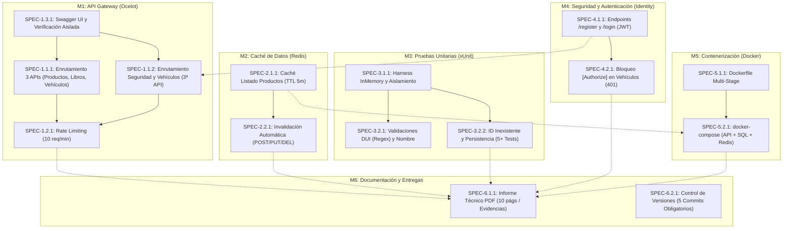

# Índice Maestro de Especificaciones Técnicas (SPEC-INDEX)

**Proyecto:** AutoGestion S.A. — Ecosistema Empresarial de Microservicios  
**Asignatura:** Desarrollo de Software Empresarial (DSE104) — Desafío 2  
**Institución:** Universidad Don Bosco — Facultad de Ingeniería  
**Versión del Índice:** 2.0.0 (Estructura Modular Subdividida Exhaustiva)  

---

## 1. Grafo de Dependencias Arquitectónicas (Mermaid)

---

## 2. Tabla Maestra de Especificaciones Técnicas

| Código SPEC | Título Descriptivo | Módulo / Área | Dependencias de Entrada | Módulos Dependientes | Componente de Código Principal | Estado |
| :--- | :--- | :--- | :--- | :--- | :--- | :---: |
| [`SPEC-1.1.1`](file:///d:/UDB/CICLO-10-2026/DES/LAB/Desafio2/specs/SPEC-1.1.1-ocelot-enrutamiento-productos-libros.md) | Enrutamiento 3 APIs (Productos, Libros, Vehículos) | M1: Gateway | SPEC-1.3.1 | SPEC-1.2.1 | `src/ApiGateway/ocelot.json` | **Especificado (100%)** |
| [`SPEC-1.1.2`](file:///d:/UDB/CICLO-10-2026/DES/LAB/Desafio2/specs/SPEC-1.1.2-ocelot-enrutamiento-seguridad-vehiculos.md) | Enrutamiento Vehículos (3ª API) y Propagación JWT | M1: Gateway | SPEC-1.3.1, SPEC-4.1.1 | SPEC-1.2.1 | `src/ApiGateway/ocelot.json` | **Especificado (100%)** |
| [`SPEC-1.2.1`](file:///d:/UDB/CICLO-10-2026/DES/LAB/Desafio2/specs/SPEC-1.2.1-ocelot-rate-limiting-control-trafico.md) | Rate Limiting Perimetral (10 req/min, 429) | M1: Gateway | SPEC-1.1.1, SPEC-1.1.2 | SPEC-6.1.1, SPEC-6.2.1 | `src/ApiGateway/ocelot.json` | **Especificado (100%)** |
| [`SPEC-1.3.1`](file:///d:/UDB/CICLO-10-2026/DES/LAB/Desafio2/specs/SPEC-1.3.1-swagger-agregacion-verificacion-aislada.md) | Swagger UI y Verificación Aislada Previa | M1: Gateway | Ninguna | SPEC-1.1.1, SPEC-1.1.2 | `Program.cs` (APIs individuales) | **Especificado (100%)** |
| [`SPEC-2.1.1`](file:///d:/UDB/CICLO-10-2026/DES/LAB/Desafio2/specs/SPEC-2.1.1-redis-almacenamiento-cache-listado-productos.md) | Almacenamiento Distribuido Redis (TTL 5m) | M2: Caché | Ninguna | SPEC-2.2.1, SPEC-5.2.1 | `ProductosService.cs` / `Redis` | **Especificado (100%)** |
| [`SPEC-2.2.1`](file:///d:/UDB/CICLO-10-2026/DES/LAB/Desafio2/specs/SPEC-2.2.1-redis-invalidacion-automatica-mutaciones.md) | Invalidación Automática en POST/PUT/DELETE | M2: Caché | SPEC-2.1.1 | SPEC-6.1.1, SPEC-6.2.1 | `ProductosController.cs` | **Especificado (100%)** |
| [`SPEC-3.1.1`](file:///d:/UDB/CICLO-10-2026/DES/LAB/Desafio2/specs/SPEC-3.1.1-xunit-entorno-inmemory-aislamiento.md) | Harness de Pruebas xUnit y EF InMemory | M3: Pruebas | Ninguna | SPEC-3.2.1, SPEC-3.2.2 | `DbContextTestFactory.cs` | **Especificado (100%)** |
| [`SPEC-3.2.1`](file:///d:/UDB/CICLO-10-2026/DES/LAB/Desafio2/specs/SPEC-3.2.1-xunit-validaciones-entidad-personas-dui.md) | Validaciones DUI (Regex) y Nombre en xUnit | M3: Pruebas | SPEC-3.1.1 | SPEC-6.1.1, SPEC-6.2.1 | `PersonasValidationTests.cs` | **Especificado (100%)** |
| [`SPEC-3.2.2`](file:///d:/UDB/CICLO-10-2026/DES/LAB/Desafio2/specs/SPEC-3.2.2-xunit-casos-prueba-persistencia-inexistente.md) | Pruebas Persistencia Exitosa e ID Inexistente | M3: Pruebas | SPEC-3.1.1 | SPEC-6.1.1, SPEC-6.2.1 | `PersonasCrudTests.cs` | **Especificado (100%)** |
| [`SPEC-4.1.1`](file:///d:/UDB/CICLO-10-2026/DES/LAB/Desafio2/specs/SPEC-4.1.1-identity-gestion-usuarios-registro-login.md) | Endpoints /register y /login con JWT | M4: Seguridad | Ninguna | SPEC-4.2.1, SPEC-1.1.2 | `AuthController.cs` / Identity | **Especificado (100%)** |
| [`SPEC-4.2.1`](file:///d:/UDB/CICLO-10-2026/DES/LAB/Desafio2/specs/SPEC-4.2.1-identity-autorizacion-filtro-vehiculos.md) | Bloqueo [Authorize] en Vehículos (HTTP 401) | M4: Seguridad | SPEC-4.1.1 | SPEC-6.1.1, SPEC-6.2.1 | `VehiculosController.cs` | **Especificado (100%)** |
| [`SPEC-5.1.1`](file:///d:/UDB/CICLO-10-2026/DES/LAB/Desafio2/specs/SPEC-5.1.1-dockerfile-optimizacion-multi-stage.md) | Dockerfile Multi-Stage para APIs | M5: Docker | Ninguna | SPEC-5.2.1 | `src/AutoGestion.Api/Dockerfile` | **Especificado (100%)** |
| [`SPEC-5.2.1`](file:///d:/UDB/CICLO-10-2026/DES/LAB/Desafio2/specs/SPEC-5.2.1-docker-compose-orquestacion-api-sql-redis.md) | Orquestación docker-compose (API+SQL+Redis) | M5: Docker | SPEC-5.1.1, SPEC-2.1.1 | SPEC-6.1.1, SPEC-6.2.1 | `docker-compose.yml` | **Especificado (100%)** |
| [`SPEC-6.1.1`](file:///d:/UDB/CICLO-10-2026/DES/LAB/Desafio2/specs/SPEC-6.1.1-informe-tecnico-pdf-evidencias-rubrica.md) | Informe Técnico en PDF y Evidencias de Rúbrica | M6: Entregas | M1, M2, M3, M4, M5 | Evaluación Académica | `docs/Informe_Tecnico.pdf` | **Especificado (100%)** |
| [`SPEC-6.2.1`](file:///d:/UDB/CICLO-10-2026/DES/LAB/Desafio2/specs/SPEC-6.2.1-control-versiones-git-commits-obligatorios.md) | Política de Control de Versiones y Commits | M6: Entregas | M1, M2, M3, M4, M5 | Evaluación de Repositorio | Historial Git (`git log`) | **Especificado (100%)** |

---

## 3. Desglose y Resumen por Módulos y Submódulos

### Módulo 1: API Gateway (Ocelot - Guía 7)
* **Submódulo 1.1: Enrutamiento Dinámico:**
  * [`SPEC-1.1.1`](file:///d:/UDB/CICLO-10-2026/DES/LAB/Desafio2/specs/SPEC-1.1.1-ocelot-enrutamiento-productos-libros.md): Unifica el acceso perimetral hacia las tres (3) APIs de AutoGestion S.A. (`/productos`, `/libros` y `/vehiculos`).
  * [`SPEC-1.1.2`](file:///d:/UDB/CICLO-10-2026/DES/LAB/Desafio2/specs/SPEC-1.1.2-ocelot-enrutamiento-seguridad-vehiculos.md): Conduce las peticiones de autenticación y transfiere cabeceras Bearer hacia la tercera API (`/vehiculos`), propagando respuestas 401 y 200.
* **Submódulo 1.2: Gobernanza de Tráfico:**
  * [`SPEC-1.2.1`](file:///d:/UDB/CICLO-10-2026/DES/LAB/Desafio2/specs/SPEC-1.2.1-ocelot-rate-limiting-control-trafico.md): Limita el tráfico a 10 req/minuto, emitiendo HTTP 429 Too Many Requests ante excesos.
* **Submódulo 1.3: Verificación Previa y Documentación:**
  * [`SPEC-1.3.1`](file:///d:/UDB/CICLO-10-2026/DES/LAB/Desafio2/specs/SPEC-1.3.1-swagger-agregacion-verificacion-aislada.md): Protocolo de verificación individual de cada API en aislamiento con Swagger UI antes del Gateway.

### Módulo 2: Caché de Datos (Redis - Guía 8)
* **Submódulo 2.1: Almacenamiento en Memoria:**
  * [`SPEC-2.1.1`](file:///d:/UDB/CICLO-10-2026/DES/LAB/Desafio2/specs/SPEC-2.1.1-redis-almacenamiento-cache-listado-productos.md): Cache-Aside en `GET /productos` con TTL de 5 minutos y fallback resiliente a SQL.
* **Submódulo 2.2: Consistencia e Invalidación:**
  * [`SPEC-2.2.1`](file:///d:/UDB/CICLO-10-2026/DES/LAB/Desafio2/specs/SPEC-2.2.1-redis-invalidacion-automatica-mutaciones.md): Purga automática de la clave de caché ante mutaciones `POST`, `PUT` y `DELETE`.

### Módulo 3: Pruebas Unitarias (xUnit - Guía 9)
* **Submódulo 3.1: Entorno y Aislamiento:**
  * [`SPEC-3.1.1`](file:///d:/UDB/CICLO-10-2026/DES/LAB/Desafio2/specs/SPEC-3.1.1-xunit-entorno-inmemory-aislamiento.md): Configuración de xUnit y EF Core InMemory con aislamiento por prueba.
* **Submódulo 3.2: Casos de Prueba de Dominio Personas:**
  * [`SPEC-3.2.1`](file:///d:/UDB/CICLO-10-2026/DES/LAB/Desafio2/specs/SPEC-3.2.1-xunit-validaciones-entidad-personas-dui.md): Pruebas para DUI inválido (`^\d{8}-\d$`), Nombre obligatorio y respuesta HTTP 400.
  * [`SPEC-3.2.2`](file:///d:/UDB/CICLO-10-2026/DES/LAB/Desafio2/specs/SPEC-3.2.2-xunit-casos-prueba-persistencia-inexistente.md): Pruebas de ID inexistente y guardado exitoso totalizando $\ge 5$ pruebas aprobadas.

### Módulo 4: Seguridad y Autenticación (Identity - Guía 10)
* **Submódulo 4.1: Identidad y Credenciales:**
  * [`SPEC-4.1.1`](file:///d:/UDB/CICLO-10-2026/DES/LAB/Desafio2/specs/SPEC-4.1.1-identity-gestion-usuarios-registro-login.md): Endpoints `/register` y `/login` con ASP.NET Core Identity y emisión de tokens JWT.
* **Submódulo 4.2: Protección y Control de Acceso:**
  * [`SPEC-4.2.1`](file:///d:/UDB/CICLO-10-2026/DES/LAB/Desafio2/specs/SPEC-4.2.1-identity-autorizacion-filtro-vehiculos.md): Decoración con `[Authorize]` en `/vehiculos` y rechazo estricto HTTP 401 sin sesión.

### Módulo 5: Contenerización (Docker)
* **Submódulo 5.1: Empaquetado:**
  * [`SPEC-5.1.1`](file:///d:/UDB/CICLO-10-2026/DES/LAB/Desafio2/specs/SPEC-5.1.1-dockerfile-optimizacion-multi-stage.md): Dockerfiles Multi-Stage de bajo peso (< 220 MB) para las APIs.
* **Submódulo 5.2: Orquestación:**
  * [`SPEC-5.2.1`](file:///d:/UDB/CICLO-10-2026/DES/LAB/Desafio2/specs/SPEC-5.2.1-docker-compose-orquestacion-api-sql-redis.md): Despliegue simultáneo de API, SQL Server y Redis con redes internas y healthchecks.

### Módulo 6: Entregables, Evidencias y Gobernanza Git
* **Submódulo 6.1: Documentación Gráfica:**
  * [`SPEC-6.1.1`](file:///d:/UDB/CICLO-10-2026/DES/LAB/Desafio2/specs/SPEC-6.1.1-informe-tecnico-pdf-evidencias-rubrica.md): Guía editorial para el informe PDF de 10 páginas con las 5 capturas de la rúbrica.
* **Submódulo 6.2: Control de Versiones:**
  * [`SPEC-6.2.1`](file:///d:/UDB/CICLO-10-2026/DES/LAB/Desafio2/specs/SPEC-6.2.1-control-versiones-git-commits-obligatorios.md): Trazabilidad de los 5 commits semánticos obligatorios en el repositorio.
